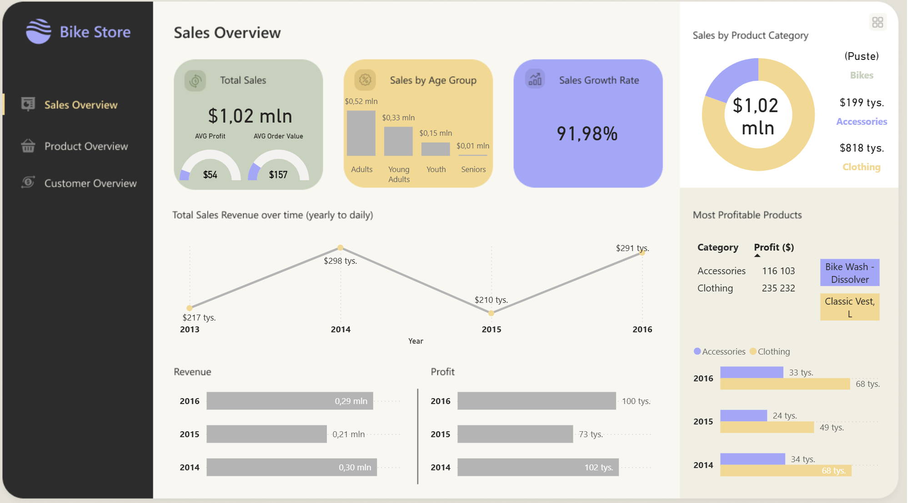
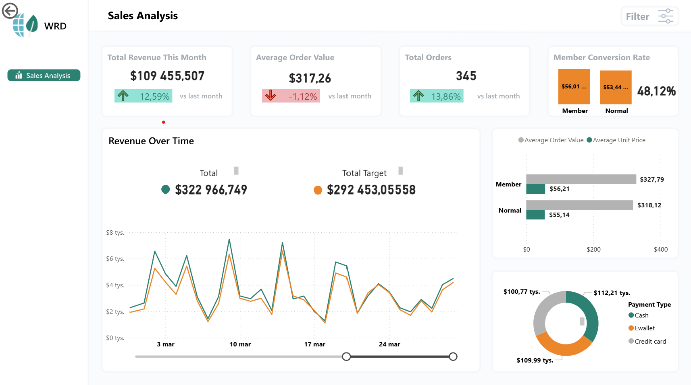

 📊 Power BI Portfolio – Alicja Bakowska

To repozytorium zawiera wybrane projekty stworzone w Power BI.

---

## 🚲 Projekt: Bike Store – analiza sprzedaży

Dashboard przedstawia analizę danych sprzedażowych sklepu rowerowego.

### Zakres analizy:
- sprzedaż według kategorii produktów i grup wiekowych klientów
- zmiany sprzedaży w czasie
- analiza najbardziej zyskownych produktów

### Kluczowe dane:
- całkowita sprzedaż: **$1,02 mln**
- wzrost sprzedaży: **+91,98%**
- najzyskowniejszy produkt: **Classic Vest, L**
- największy udział w sprzedaży: **odzież**

### Podgląd dashboardu:

---

## 📈 Projekt: Sales Performance – analiza wyników sprzedaży

Dashboard przedstawia analizę miesięcznej sprzedaży i zachowań klientów w sklepie.

### Zakres analizy:
- przychód całkowity i jego zmiana miesiąc do miesiąca
- średnia wartość zamówienia i liczba zamówień
- współczynnik konwersji klientów z „Normal” na „Member”
- porównanie wyników z targetem
- rodzaje płatności i średnia cena jednostkowa

### Kluczowe dane:
- przychód w tym miesiącu: **$109,5 mln** (+12,59%)
- średnia wartość zamówienia: **$317,26**
- liczba zamówień: **345**
- współczynnik konwersji: **48,12%**
- całkowity przychód: **$322,97 mln** (vs target $292,45 mln)

### Podgląd dashboardu:

